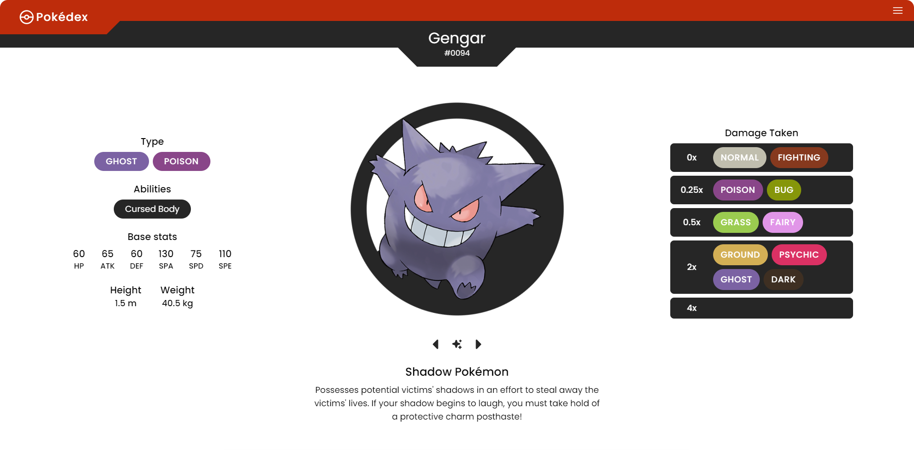
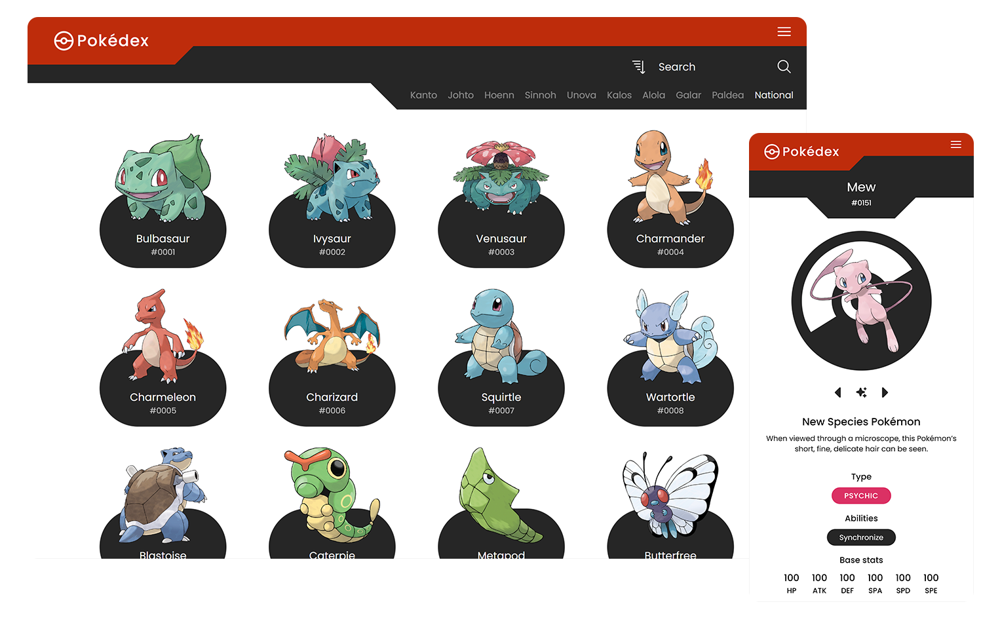

# Pokédex

A modern web-based **Pokédex** built with **React** and styled with **Tailwind CSS**. It fetches data from the **PokeAPI** to provide detailed information about all Pokémon up to Generation IX, including their abilities, moves, stats, and more.

## Screenshots




## Features

- Responsive design using Tailwind CSS
- Complete Pokédex entries up to Generation IX
- Detailed information for each Pokémon including:
  - Type(s)
  - Base stats
  - Abilities
  - Moves
  - Evolution chains
  - Specie varieties
- View shiny and regional forms
- Play pokemon's cry
- Search functionality by name or Pokédex number
- Filter Pokémon by Generation

## API Reference

Project uses the [PokéAPI](https://pokeapi.co/api/v2/) for fetching Pokémon data. This is a consumption-only API — only the HTTP GET method is available on resources. No authentication is required to access it and all resources are fully open and available.

```
  GET https://pokeapi.co/api/v2/{endpoint}
```

## Getting Started

### 1. Clone the Repository

```bash
git clone https://github.com/Sulkhans/Pokedex.git
cd Pokedex
```

### 2. Install Dependencies

```bash
npm install
# or
yarn install
```

### 3. Run the Project

```bash
npm run dev
# or
yarn dev
```

Open http://localhost:5173 to view it in the browser.
